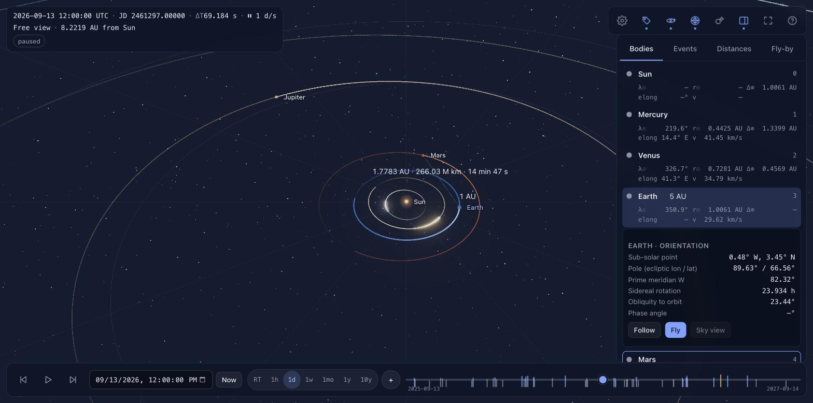
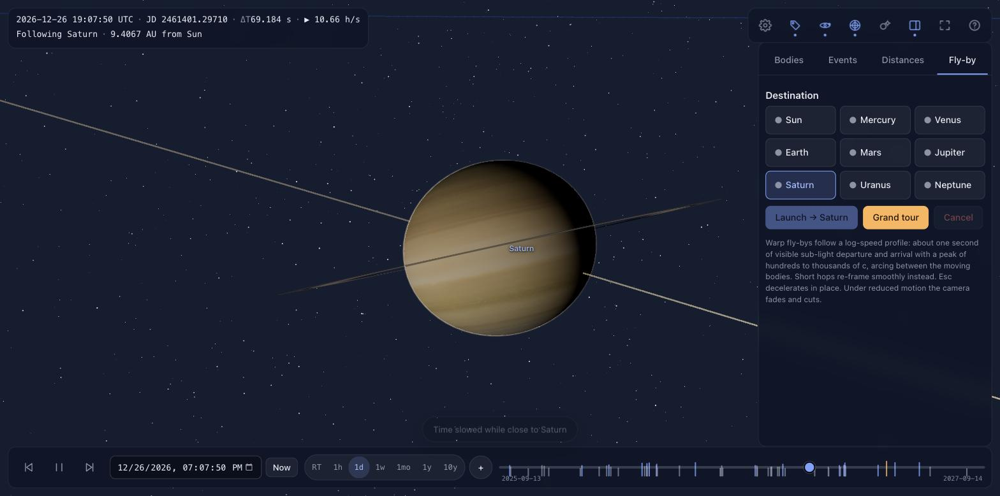

# Solar Map

Solar map displays our planets' orientation across time, relative distance from each other, notable alignments,
theatrical fly bys with faster than light smooth acceleration in an animated fashion, all directly in your browser!

Run it locally with `npm install && npm run dev`, or publish the committed `docs/` build with GitHub Pages
(**Settings → Pages → Source: deploy from a branch → `main` / `/docs`**); it is then served at
`https://<user>.github.io/<repo>/`.

The map is computed, not animated: every position, distance, alignment time and rotation phase comes from the
VSOP87A planetary theory and the IAU rotation models evaluated in double precision, and is checked against JPL
Horizons in the test suite.





## What it does

- **Orientation across time.** All eight planets for any date from 4000 BC to AD 4000, with true axial tilt and
  spin phase (IAU WGCCRE 2015 elements; Earth from sidereal time and precession). Play, scrub, or type a date;
  rates from real time to ten years per second. The selected body shows its sub-solar point, pole, prime-meridian
  angle, rotation period, obliquity and orbital speed, with an optional overlay drawing the axis, prime meridian
  and sub-solar point.
- **Relative distances.** A live table from the selected body to every other one in AU, million km and light-time,
  plus an on-scene beam with a mid-point readout.
- **Notable alignments.** Oppositions, inferior and superior conjunctions, greatest elongations, planet–planet
  close approaches, transits, Earth–planet closest approaches, perihelia and aphelia, heliocentric parades and
  geocentric "planet parades" — found by scanning the ephemeris and refining with Brent's method to the second,
  ranked by a notability score, listed with jump-to-time, marked on the timeline, and drawn in the scene.
- **Theatrical fly-bys.** A log-speed profile gives about a second of visible sub-light departure and arrival on
  every hop, peaks of hundreds to tens of thousands of × c, continuous velocity and acceleration, star-streak
  warp, a light-speed beat as the camera crosses c, and arrival into a follow view. There is a grand tour, and a
  guided tour of real events plays on first load.
- **In your browser.** A static site: no server, no runtime API calls, no tracking.

## Precision

Positions come from VSOP87A (Bretagnon & Francou 1988) rotated into the JPL "Ecliptic of J2000.0" frame. Measured
against JPL Horizons (DE441) over 1900–2100, after that rotation:

| Body | Position residual | Angular |
|---|---|---|
| Mercury, Venus, Earth | ≤ 20–25 km | ≤ 0.05″ |
| Mars | ≤ 150 km | ≤ 0.15″ |
| Jupiter, Saturn | ≤ 2,000 km | ≤ 0.5″ |
| Uranus | ≤ 20,000 km | ≤ 1.5″ |
| Neptune | ≤ 60,000 km | ≤ 3.0″ |

Uranus and Neptune are limited by VSOP87 itself, which was fitted to DE200: that error is intrinsic to the theory,
grows outside 1600–2600, and is stated in the app's About panel rather than hidden. Event times are geometric (no
light-time or aberration): oppositions and conjunctions differ from almanac "apparent" times by 6–40 minutes,
greatest elongations by up to a few hours, while the angles agree to 0.002°.

Time: JD(UTC) is the single source of truth; the ephemeris is evaluated at TT using the IERS leap-second table
through its expiry (2027-06-28) and Espenak–Meeus polynomials outside it, with TDB applied to the series argument.

## Verification

```bash
npm test          # 327 assertions: node --test, no browser needed
```

The suite checks the generated series against the official VSOP87 check file, the rotated positions and velocities
against committed JPL Horizons fixtures (per body and per epoch band), ΔT against USNO values, the IAU orientation
model against NSSDC obliquities and Horizons-derived sub-solar points, roughly forty reference events (Mars
opposition 2025-01-16 02:31 UTC, the 2020 great conjunction at 6.1′, Mars's 2003 closest approach at
55,758,006 km, and more) against Horizons-derived instants and published almanacs, the fly-by profile's integral
and continuity, and the simulation clock for drift over a million frames.

Regenerate the data (both scripts are rate-limited and cache their downloads):

```bash
npm run data:vsop87     # IMCCE VSOP87A → src/astro/data/vsop87a.js + fixtures
npm run data:horizons   # JPL Horizons  → test/fixtures/horizons/*.json
npm run ephem -- 2026-09-13T12:00:00Z   # print states, sub-solar point and residuals
```

## Build and deploy

```bash
npm run dev       # http://localhost:5173
npm run build     # → docs/ (GitHub Pages: Settings → Pages → main /docs)
npm run preview
```

`index-nobuild.html` runs the same sources with an import map and no build step.

## Controls

Space play/pause · `[` `]` rate · ← → ∓1 day (Shift 7 d, Alt 1 yr) · `T` now · `0`–`8` select Sun…Neptune ·
`F` fly to selection · `V` sky view from Earth · `Esc` cancel · `Home` reset view · `L`/`O`/`G` labels, orbits,
grid · `P` planet size · `?` shortcuts. Click a body to select, double-click to fly, shift-click for the distance
beam.

## Sources

Data and licences are listed in [LICENSES.md](LICENSES.md): VSOP87 (IMCCE), JPL Horizons, IAU WGCCRE 2015,
IERS/USNO time scales, NASA NSSDC parameters, Solar System Scope surface maps (CC BY 4.0), webgl-noise (MIT),
three.js (MIT).
